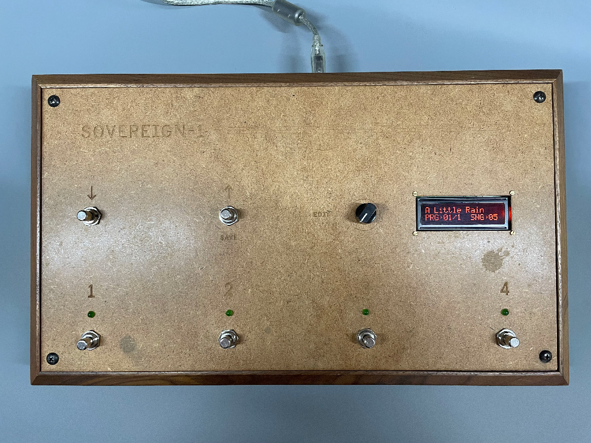

# Sovereign-1

The _Sovereign-1_ is a bulky prototype for a programmable foot-operated Midi device.

Sovereign-1 sends CC messages to change presets on connected synths/keyboards. It features 4 preset-change buttons and groups them into _songs_. One can page through songs via up/down buttons. Since the device displays song titles, it serves as a digital setlist for live performances as well. The Sovereign features on-board programming: a rotary switch quickly dials through characters and numeric values, another push button moves the cursor.

# Firmware

The firmware in this repo is written in C to compile for a simple Ardiuno-compatible microcontroller. It covers all basic functions (including on-device patch programming), passed several _real-world_ tests (10+ life performances with a band) and therefore represents a solid MVP.s
